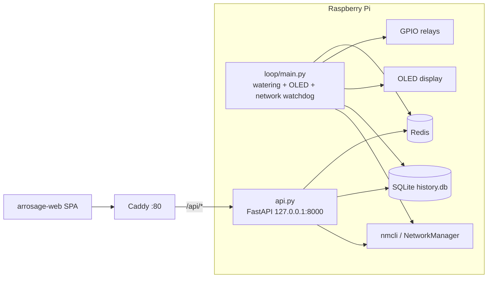

# Arrosage

Automated 8-relay watering system for Raspberry Pi. The Pi drives an
8-channel relay board and a Waveshare OLED 1.5" B display, exposes a
FastAPI backend, and is controlled through a Vite SPA (sibling repo
`arrosage-web`). **Redis** holds live state (mode, settings, active
sequence, network watchdog keys). **SQLite** logs relay activity for
reporting. A **ping-based network watchdog** in `loop/main.py` monitors
internet reachability, accepts a Wi-Fi client profile via the API, and
falls back to a WPA2 AP (sticky until reboot) when pings fail.

## Architecture



| Component | Role |
|-----------|------|
| [`loop/main.py`](loop/main.py) | 200 ms control loop: sequence progression, auto schedule trigger, OLED refresh, network watchdog thread |
| [`api.py`](api.py) | HTTP API for mode, settings, relay control, history, network |
| [`data/`](data/) | Redis helpers, mode/status/settings, SQLite history |
| [`hardware/`](hardware/) | GPIO relay driver, OLED display + French UI renderer |
| [`network/`](network/) | NetworkManager wrappers, AP/STA profiles, Redis `network:*` state |
| [`deploy/`](deploy/) | systemd units, Caddy install scripts |

## Modes

Four modes are stored in Redis key `mode` (see [`data/mode.py`](data/mode.py)):

| Mode | Enter via | Sequence behaviour |
|------|-----------|-------------------|
| **`manual`** | `POST /mode` `{"mode":"manual"}` | No automatic sequence; open/close relays via `POST /relay/open` and `POST /relay/close` |
| **`semi_auto`** | `POST /mode` `{"mode":"semi_auto"}` | Idle until `POST /start`, then the loop advances relays automatically |
| **`auto`** | `POST /mode` `{"mode":"auto"}` | Loop starts the sequence when the current local time **exactly matches** `settings.start_at` (`HH:MM`) on an enabled weekday |
| **`pause`** | `POST /pause` | Relays closed, sequence frozen; `POST /resume` restores the previous mode and shifts remaining duration |

The main loop (`loop/main.py`) runs sequence logic only in **`auto`** and
**`semi_auto`**. In **`manual`** and **`pause`** it still refreshes the
OLED but does not advance steps.

## Settings

Redis key `settings` is a JSON object (not a flat array):

```json
{
  "start_at": "20:00",
  "sequence": [3600, 3600, 3600, 3600, 3600, 3600, 3600, 0],
  "schedule": [false, false, false, false, false, false, true]
}
```

| Field | Meaning |
|-------|---------|
| `start_at` | Daily start time for **auto** mode (`HH:MM`, local time) |
| `sequence` | Duration in seconds for relays 0–7 (relay stays open this long before advancing) |
| `schedule` | 7 booleans, Monday (index 0) through Sunday (index 6) |

### Seed / inspect Redis

Bootstrap defaults (and `mode`) with the seeder:

```bash
python data/seeder/redis_settings_writer.py
```

Inspect current values:

```bash
python redis_settings_reader.py
```

Redis connection settings can be overridden in an optional gitignored
[`redis_config.py`](redis_config.py) (`REDIS_HOST`, `REDIS_PORT`, `REDIS_DB`,
`REDIS_PASSWORD`). When absent, [`data/redis.py`](data/redis.py) defaults
to `localhost:6379`.

## Hardware

### Relays

8 channels on BCM GPIO pins (see [`hardware/relay/relays.py`](hardware/relay/relays.py)):

```
Relay 0..7  →  pins [5, 6, 13, 16, 19, 20, 21, 26]
LOW  = relay open (water on)
HIGH = relay closed (water off)
```

### OLED

Waveshare **OLED 1.5" B** (128×128, SPI) via
[`hardware/screen/display.py`](hardware/screen/display.py). The French UI
is rendered in [`hardware/screen/renderer.py`](hardware/screen/renderer.py).
If the display cannot be initialized, the loop continues without it.

**Font file:** the renderer expects
`hardware/screen/fonts/Font.ttc`, which is **not shipped in this repo**
— deploy it separately on the Pi.

## HTTP API

The API binds to **`127.0.0.1:8000`** when run directly (`python api.py`
or `arrosage-api.service`). In production, **Caddy** on port 80 serves
the SPA and reverse-proxies `/api/*` to the backend (with HTTP Basic Auth).

**Full request/response schemas:** [`openapi.yaml`](openapi.yaml) is the
source of truth. Load it into [Swagger Editor](https://editor.swagger.io/)
or Redoc for an interactive view.

Endpoint groups (21 routes total):

| Area | Routes |
|------|--------|
| Discovery | `GET /` |
| Mode | `GET /mode`, `POST /mode` |
| Status & sequence | `GET /status`, `DELETE /sequence/relay/{relay_id}` |
| Control | `POST /pause`, `POST /resume`, `POST /reset`, `POST /start` |
| Manual relay | `POST /relay/open`, `POST /relay/close`, `GET /relays` |
| Settings | `GET /settings`, `POST /settings` |
| History | `GET /history`, `GET /history/stats` |
| Network | `GET /network/status`, `POST /network/force`, `GET/PUT/DELETE /network/wifi` |

Example calls (dev, direct to API):

```bash
# Mode
curl http://127.0.0.1:8000/mode
curl -X POST http://127.0.0.1:8000/mode -H 'Content-Type: application/json' -d '{"mode":"semi_auto"}'

# Settings
curl http://127.0.0.1:8000/settings

# Start sequence (semi_auto only)
curl -X POST http://127.0.0.1:8000/start

# History
curl 'http://127.0.0.1:8000/history?page=1&page_size=10'
curl 'http://127.0.0.1:8000/history/stats?period=month&year=2026&month=4'

# Network
curl http://127.0.0.1:8000/network/status
```

API logging is documented in [`LOGGING.md`](LOGGING.md).

## Relay activity history (SQLite)

In addition to live Redis state, every relay open/close cycle is
persisted to a small SQLite database for reporting (dashboards, past
runs). Redis remains the state manager; SQLite is the durable log.

### Storage

- File: `data/history.db` (git-ignored, plus `history.db-wal` / `history.db-shm`)
- Pragmas: `journal_mode=WAL`, `synchronous=NORMAL` (Pi / SD-card friendly)
- One row per relay activity, inserted **when the relay is closed** so the
  recorded `duration_s` is the actual time the relay stayed open.

### Schema

```sql
CREATE TABLE relay_activity (
    id          INTEGER PRIMARY KEY AUTOINCREMENT,
    relay_id    INTEGER NOT NULL CHECK (relay_id BETWEEN 0 AND 7),
    opened_at   INTEGER NOT NULL,   -- unix epoch seconds (UTC)
    duration_s  INTEGER NOT NULL CHECK (duration_s >= 0),
    mode        TEXT    NOT NULL CHECK (mode IN ('auto','semi_auto','manual'))
);
CREATE INDEX idx_relay_activity_opened_at ON relay_activity(opened_at);
CREATE INDEX idx_relay_activity_relay_id  ON relay_activity(relay_id);
```

### Inspect with the CLI

```bash
sqlite3 data/history.db 'SELECT * FROM relay_activity ORDER BY id DESC LIMIT 10;'
```

### API

See [`openapi.yaml`](openapi.yaml) for full query parameters and response shapes.

- `GET /history?page=1&page_size=100&relay_id=&start=&end=` — paginated
  list, newest first. `start` / `end` are unix seconds (UTC).
- `GET /history/stats?period=month&year=2026&month=4` — aggregate totals
  and per-relay breakdown. `period=year&year=2026` also supported.

Period boundaries (`start_at` / `end_at`) for `/history/stats` are
computed in the Pi's local timezone, so "April" means the whole local
calendar month.

## Network management

The backend monitors **internet reachability** with ICMP pings to
`PING_TARGET` (default `8.8.8.8`): two pings, `PING_PAUSE_S` seconds
apart, every `POLL_INTERVAL_S` (default 60 s). If **either** ping fails,
the Pi disconnects Ethernet, brings up a WPA2 **Wi-Fi AP** on `wlan0`,
and stops checking — **AP mode is sticky until reboot**.

A user-configured **Wi-Fi client** profile (via the HTTP API) can still
provide an uplink: pings use the OS default route, so a working STA
connection counts as LAN even when Ethernet is down.

On the AP network (and on LAN), the UI is reachable as
**`http://arrosage.local`** via mDNS (avahi-daemon, installed by
[`deploy/install-services.sh`](deploy/install-services.sh)).

### Environment file

Runtime settings (AP SSID/PSK/channel, interfaces, ping tuning) live in
a single root-readable env file. The bundled helper creates it with a
**default AP PSK of `arrosageberry`** (override before running for
production):

```bash
sudo ./init-network-env.sh
```

The script prints the SSID and PSK once. Override any value via the
environment, e.g.:

```bash
sudo AP_SSID=arrosage-field AP_PSK=my-strong-psk ./init-network-env.sh
```

The script refuses to overwrite an existing file; pass `FORCE=1` to
replace it (the current PSK will be lost). If you prefer to write the
file by hand:

```bash
sudo install -d -m 0755 /etc/arrosage
sudo tee /etc/arrosage/network.env > /dev/null <<'EOF'
# Wi-Fi AP fallback (WPA2-PSK). Used when ping checks fail.
AP_SSID=arrosage-setup
AP_PSK=change-me-strong-password
AP_CHANNEL=6
AP_IFACE=wlan0

# Wired LAN interface disconnected when entering AP mode.
LAN_IFACE=eth0

# Watchdog tuning (ping-based, sticky AP until reboot).
POLL_INTERVAL_S=60
PING_TARGET=8.8.8.8
PING_TIMEOUT_S=3
PING_PAUSE_S=5
EOF
sudo chmod 600 /etc/arrosage/network.env
sudo chown root:root /etc/arrosage/network.env
```

The PSK must be **8..63 characters**; shorter values make
`network.ap.ensure_profile` refuse to provision the AP (so it is never
broadcast open by accident).

For development the path can be overridden without touching `/etc`:

```bash
ARROSAGE_NETWORK_ENV=$PWD/dev.network.env python loop/main.py
```

### Redis keys used

The watchdog is the sole writer of `network:mode`,
`network:lan_last_ok_at`, `network:ap_active_since` and
`network:ap_ssid`. The HTTP API writes `network:force` as a one-shot
intent (`ap` only; `auto` is rejected).

### One-time host provisioning

The backend relies on NetworkManager (default on Raspberry Pi OS
Bookworm) and creates the AP profile itself on first boot, but the host
still needs a handful of one-off steps.

1. **Enable the radio.** Fresh images often leave Wi-Fi rfkill-blocked:

   ```bash
   sudo rfkill unblock wifi
   ```

2. **Set the regulatory domain** before the AP is activated for the
   first time, otherwise NetworkManager may refuse some channels or
   power levels:

   ```bash
   sudo iw reg set FR   # or your 2-letter country code
   ```

3. **Grant permission to manage NetworkManager.** The watering loop and
   the API both call `nmcli connection add/modify/delete/up/down`. The
   simplest option, matching the current `start.sh`, is to run them as
   root via systemd. If you prefer a non-root user, install a polkit
   rule like:

   ```javascript
   // /etc/polkit-1/rules.d/50-arrosage.rules
   polkit.addRule(function(action, subject) {
       if (subject.user === "arrosage" && (
           action.id === "org.freedesktop.NetworkManager.network-control" ||
           action.id === "org.freedesktop.NetworkManager.settings.modify.system"
       )) {
           return polkit.Result.YES;
       }
   });
   ```

4. **(Optional) Pre-create the AP profile.** The watchdog runs
   `ap.ensure_profile()` on startup, but you can provision it manually
   for testing:

   ```bash
   sudo nmcli connection add \
     type wifi ifname wlan0 con-name arrosage-ap \
     autoconnect no ssid "arrosage-setup" mode ap \
     802-11-wireless.band bg 802-11-wireless.channel 6 \
     802-11-wireless-security.key-mgmt wpa-psk \
     802-11-wireless-security.proto rsn \
     802-11-wireless-security.pairwise ccmp \
     802-11-wireless-security.group ccmp \
     802-11-wireless-security.psk "your-ap-password" \
     ipv4.method shared ipv6.method ignore
   ```

5. **mDNS hostname.** Run `sudo ./deploy/install-services.sh` (or
   re-run it after pulling) to install `avahi-daemon` and set
   `host-name=arrosage` so clients can open `http://arrosage.local`.

### Configuring a Wi-Fi client profile at runtime

Once the Pi is reachable (over Ethernet, Wi-Fi STA, or the fallback AP),
the client profile is created via the HTTP API:

```bash
curl -X PUT http://<host>/api/network/wifi \
     -H 'Content-Type: application/json' \
     -d '{"ssid": "home-network", "security": "wpa2-psk", "psk": "correct-horse-battery-staple"}'
```

Other useful calls (via Caddy in production, or `127.0.0.1:8000` in dev):

```bash
curl http://<host>/api/network/status
curl http://<host>/api/network/wifi
curl -X DELETE http://<host>/api/network/wifi
curl -X POST http://<host>/api/network/force \
     -H 'Content-Type: application/json' \
     -d '{"target": "ap"}'   # sticky until reboot; "auto" returns 400
```

### Security caveat

`api.py` has no authentication of its own. In production, **Caddy HTTP
Basic Auth** protects port 80 (see below). The `PUT /network/wifi`
endpoint accepts the PSK in plaintext over HTTP, and `POST /network/force`
can flip the Pi into AP mode. Do not expose the API on the LAN without
Caddy (or another auth layer) in front of it.

## Running as a service

In production, the Pi runs two `systemd` units for the app plus **Caddy**
on port 80 (instead of `start.sh`, which is kept as a dev-only convenience):

- `arrosage-loop.service` — watering loop, OLED renderer, and network
  watchdog. Runs as `root` (needs GPIO, I²C, and `nmcli` to reconfigure
  NetworkManager).
- `arrosage-api.service` — FastAPI backend on **127.0.0.1:8000** (not
  exposed on the LAN). Runs as `root` because some endpoints (e.g.
  `PUT /network/wifi`) drive `nmcli` too.
- **Caddy** (`caddy.service`) — serves the built SPA from
  `arrosage-web/dist` and reverse-proxies `/api/*` to the API (prefix
  stripped). Install with
  [`deploy/install-caddy.sh`](deploy/install-caddy.sh). The frontend
  bundle uses `VITE_API_BASE_URL=/api` so the browser talks same-origin
  to Caddy (LAN, Cloudflare, or `localhost` during dev with a matching
  proxy).

Unit files live in the repo under
[`deploy/systemd/`](deploy/systemd/) and the installer at
[`deploy/install-services.sh`](deploy/install-services.sh) copies them
to `/etc/systemd/system/`, runs `daemon-reload`, and enables them.
Re-running `install-services.sh` disables and removes any legacy
`arrosage-web.service` (old `vite preview` on :5173).

**Note:** the shipped unit files hardcode paths under
`/home/jnfrm/projects/arrosage/arrosage-python` and
`/home/jnfrm/venv`. Edit them before installing on a different layout.

### Prerequisites (once)

1. Redis and NetworkManager enabled at boot:
   ```bash
   sudo systemctl enable --now redis-server.service NetworkManager.service
   ```
2. Python venv at `/home/jnfrm/venv` with [`requirements.txt`](requirements.txt) installed.
3. Network env file provisioned:
   ```bash
   sudo ./init-network-env.sh
   ```
4. Web bundle built once:
   ```bash
   cd ../arrosage-web && npm ci && npm run build
   ```
5. Regulatory country: the loop unit runs `iw reg set FR` on start.
   Edit `deploy/systemd/arrosage-loop.service` (and reinstall) if you
   deploy outside France.

### Install

```bash
sudo ./deploy/install-services.sh
```

The script refuses to run if any prerequisite is missing (venv python,
`arrosage-web/dist/`, `/etc/arrosage/network.env`, …) and prints a clear
reason. It is idempotent — re-running it overwrites the installed units
with whatever is currently in the repo.

### Check

```bash
systemctl status arrosage-loop arrosage-api caddy
journalctl -u arrosage-loop -f
journalctl -u arrosage-api  -f
journalctl -u caddy -f
```

### Update flow

#### Sync from laptop

When developing on another machine, push the working tree to the Pi with
[`scripts/sync.sh`](scripts/sync.sh). It stops `arrosage-loop` and
`arrosage-api`, rsyncs the repo to
`/home/jnfrm/projects/arrosage/arrosage-python` (preserving Pi-only
files such as `redis_config.py` and `data/history.db`), then restarts the
services. Run `./scripts/sync.sh -n` for a dry run, or
`./scripts/sync.sh --no-restart` to sync without bringing services back
up. Sudo on the Pi will prompt for your password once per stop/start.

Python code changed:

```bash
git pull
sudo systemctl restart arrosage-loop arrosage-api
```

Web UI changed:

```bash
git pull
cd ../arrosage-web && npm run build
sudo systemctl restart caddy
```

Unit files changed (anything under `deploy/systemd/`):

```bash
sudo ./deploy/install-services.sh
```

### Caddy and first-time reverse proxy

After building the web app, run:

```bash
sudo ./deploy/install-caddy.sh
```

Then `sudo ./deploy/install-services.sh` as usual. To refresh Caddy
config only: `sudo ./deploy/install-caddy.sh` again (overwrites
`/etc/caddy/Caddyfile` and the systemd drop-in).

### Caddy HTTP Basic Auth

The Caddyfile protects **all** of `:80` (static UI and `/api`) with a
single user **`arrosage`**. The password is **never** stored in git;
only a **bcrypt hash** lives on the Pi in
`/etc/arrosage/caddy-basic-auth.env`.

1. On the Pi, generate a hash (interactive is best so the password is
   not left in shell history):

   ```bash
   caddy hash-password
   ```

2. Create `/etc/arrosage/caddy-basic-auth.env` with one line (use the
   full string `caddy` printed). Bcrypt values start with `$2a$` / `$2y$`;
   **systemd** reads this file without shell expansion, so those `$`
   characters are fine. (Do not `source` the file in bash with `set -u`.)

   ```bash
   ARROSAGE_BASIC_AUTH_HASH=$2a$14$...
   ```

3. Caddy runs as `jnfrm`; the file must be readable by that user, e.g.:

   ```bash
   sudo chown root:jnfrm /etc/arrosage/caddy-basic-auth.env
   sudo chmod 640 /etc/arrosage/caddy-basic-auth.env
   ```

4. Deploy / reload:

   ```bash
   sudo ./deploy/install-caddy.sh
   ```

See [`deploy/caddy/caddy-basic-auth.env.example`](deploy/caddy/caddy-basic-auth.env.example)
for a commented template. `install-caddy.sh` refuses to run if the env
file is missing, the hash is not a plausible bcrypt string, or `jnfrm`
cannot read the file.

After changing the password, regenerate the hash, update the env file,
and run `sudo systemctl restart caddy`.

## Development quickstart

Prerequisites: Python 3, Redis running locally, and dependencies from
[`requirements.txt`](requirements.txt) (FastAPI, uvicorn, gpio/OLED libs
for Pi hardware, etc.).

```bash
python3 -m venv venv && source venv/bin/activate
pip install -r requirements.txt

# Seed Redis (optional)
python data/seeder/redis_settings_writer.py

# Run loop + API together (dev only)
./start.sh
```

[`start.sh`](start.sh) launches `loop/main.py` in the background and
`api.py` in the foreground, using `/home/jnfrm/venv/bin/python` by
default — adjust the path for your machine.

Network env override for local dev:

```bash
ARROSAGE_NETWORK_ENV=$PWD/dev.network.env python loop/main.py
```

## Tests and debug scripts

These are **manual scripts**, not a pytest suite:

| Script | Purpose |
|--------|---------|
| [`test_settings.py`](test_settings.py) | Read/validate Redis settings; optional GET `/settings` via API |
| [`test_reset.py`](test_reset.py) | Call `commands.reset.reset()` directly |
| [`test_api_reset.py`](test_api_reset.py) | Exercise `POST /reset` against a running API |
| [`tests/test_main_loop_auto.py`](tests/test_main_loop_auto.py) | Integration: auto mode schedule + relay progression |
| [`tests/test_semi_auto.py`](tests/test_semi_auto.py) | Integration: semi_auto start + relay progression |

## Troubleshooting

1. **Redis connection error** — ensure Redis is running (`redis-server`) and reachable; check optional `redis_config.py`.
2. **Authentication error** — set the correct password in `redis_config.py` if Redis requires auth.
3. **Permission error** — ensure the process user can access Redis and, on the Pi, GPIO/I²C (systemd units run as `root` for this reason).
4. **OLED not showing** — the loop degrades gracefully; check SPI wiring and that `hardware/screen/fonts/Font.ttc` is present on the Pi.
5. **Network watchdog inactive** — verify NetworkManager is installed and `/etc/arrosage/network.env` exists (or set `ARROSAGE_NETWORK_ENV`).
6. **AP not broadcasting** — PSK must be 8–63 characters; run `sudo rfkill unblock wifi` and set the regulatory domain (`iw reg set XX`).
